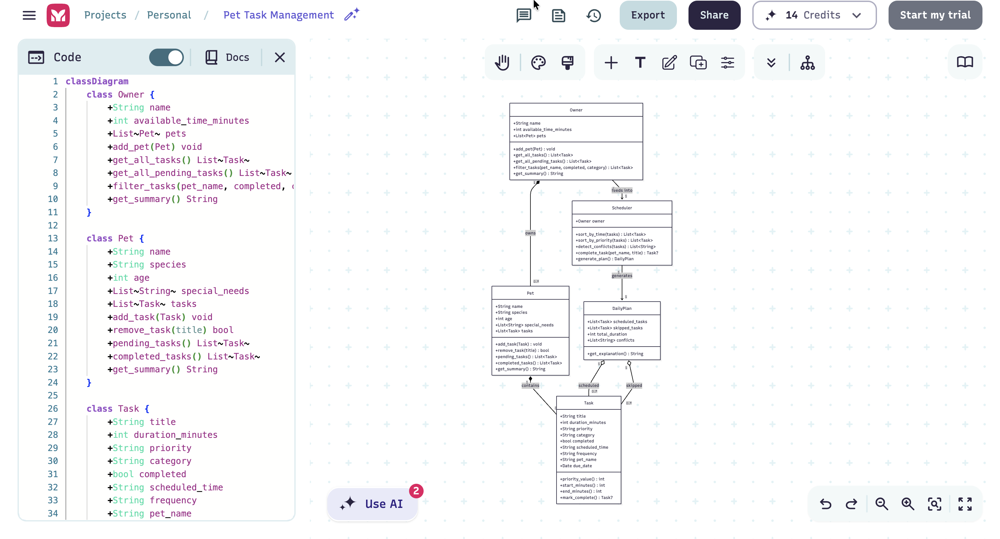
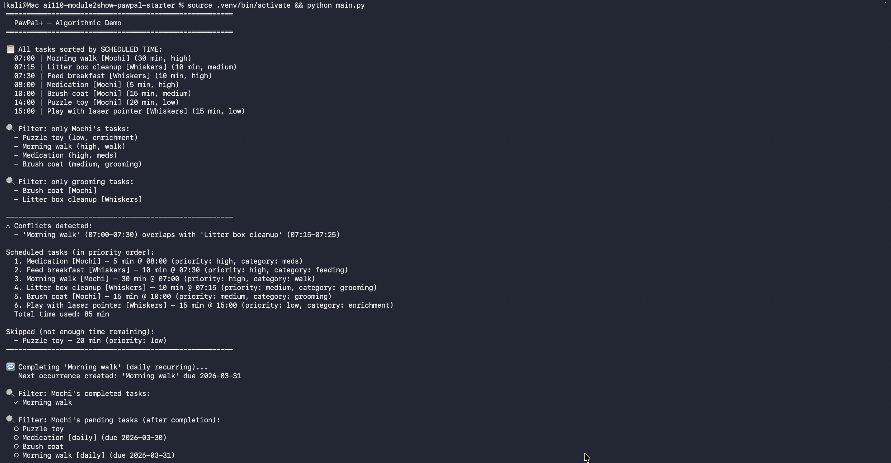
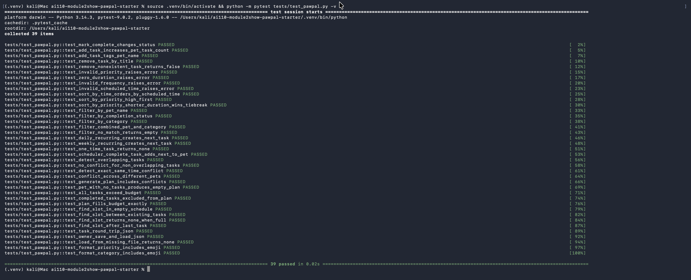
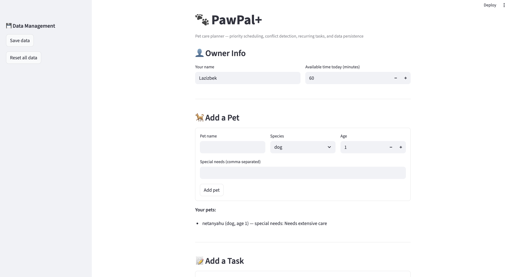
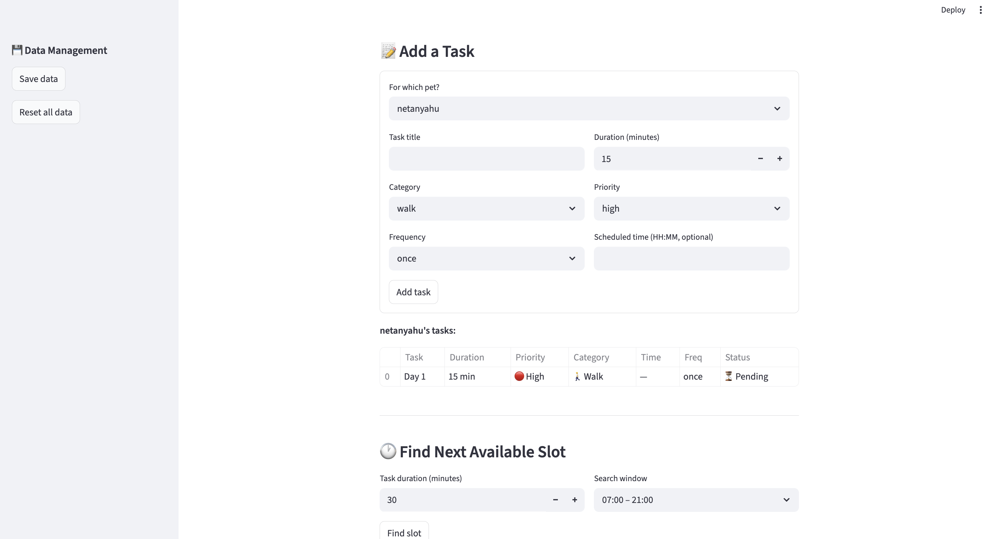
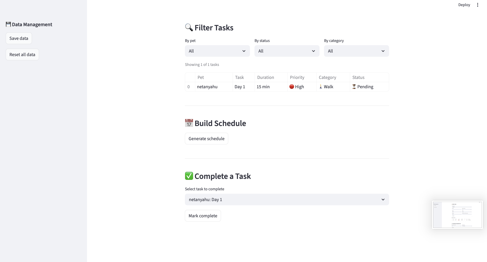

# PawPal+ Project Reflection

## 1. System Design

**a. Initial design**

The initial UML design uses five classes, each with a single clear responsibility:

- **Owner** (dataclass) — Holds the owner's name and their daily time budget (`available_time_minutes`). This is the primary constraint the scheduler works within.
- **Pet** (dataclass) — Stores the pet's name, species, age, and a list of special needs. Provides context so the scheduler or explanation can reference pet-specific details.
- **Task** (dataclass) — Represents one care activity with a title, duration, priority level, and category. Includes `priority_value()` to convert the priority string into a numeric weight for sorting.
- **Scheduler** (regular class) — The central engine. It receives an Owner, Pet, and list of Tasks, then `generate_plan()` sorts tasks by priority, fits them within the time budget, and returns a DailyPlan.
- **DailyPlan** (dataclass) — The output. Separates tasks into `scheduled_tasks` (what fits) and `skipped_tasks` (what didn't), and `get_explanation()` produces a human-readable rationale.

Relationships: Owner and Pet feed into Scheduler as constraints/context. Tasks are the inputs. Scheduler produces a DailyPlan, which references Tasks.

**Core user actions identified from the scenario:**

1. **Enter owner and pet info** — A user can register basic details about themselves (name, available time per day) and their pet (name, species, any special needs). This information provides the constraints the scheduler needs to build a realistic plan.

2. **Add or edit care tasks** — A user can create, modify, and remove pet care tasks such as walks, feeding, medication, enrichment, and grooming. Each task has at minimum a duration and a priority level, which feed directly into the scheduling logic.

3. **Generate a daily care plan** — A user can request a daily schedule that fits their available time. The system prioritizes tasks by importance, respects time constraints, and displays the resulting plan along with an explanation of why it chose that particular ordering (e.g., high-priority medication before optional enrichment).

**Building blocks (classes, attributes, and methods):**

1. **Owner** — Represents the pet owner and their constraints.
   - Attributes: `name` (str), `available_time_minutes` (int — total time budget per day)
   - Methods: `get_summary()` — returns a readable description of the owner's profile

2. **Pet** — Represents the pet being cared for.
   - Attributes: `name` (str), `species` (str — dog, cat, or other), `age` (int), `special_needs` (list[str] — e.g., "needs daily medication")
   - Methods: `get_summary()` — returns a readable description of the pet

3. **Task** — A single care activity that can be scheduled.
   - Attributes: `title` (str), `duration_minutes` (int), `priority` (str — low, medium, or high), `category` (str — walk, feeding, meds, enrichment, grooming)
   - Methods: `priority_value()` — converts the priority string to a numeric weight (high=3, medium=2, low=1) so the scheduler can sort and compare tasks

4. **Scheduler** — The engine that builds a plan from tasks and constraints.
   - Attributes: `owner` (Owner), `pet` (Pet), `tasks` (list[Task])
   - Methods: `generate_plan()` — sorts tasks by priority (highest first), fits them into the owner's available time budget, and returns a DailyPlan object

5. **DailyPlan** — The output schedule for a given day.
   - Attributes: `scheduled_tasks` (list[Task] — ordered tasks that fit), `skipped_tasks` (list[Task] — tasks that didn't fit in the time budget), `total_duration` (int — sum of scheduled task durations)
   - Methods: `get_explanation()` — produces a human-readable rationale for why each task was included or skipped and why they appear in that order

**b. Design changes**

Yes, two changes were made after reviewing the skeleton against the starter app and potential edge cases:

1. **Added a default value for `Task.category`** — The original UML required a category for every task, but the starter app's UI doesn't collect one. Changed `category` to default to `"general"` so tasks can be created without specifying a category, matching the existing UI contract.

2. **Added `__post_init__` validation on `Task.priority`** — The priority field accepted any string, but `priority_value()` depends on it being "low", "medium", or "high". Added a validation step that raises a `ValueError` for invalid priorities. This catches bad input at construction time rather than letting it silently produce wrong scheduling results downstream.

**c. Screenshots**

UML class diagram (rendered from Mermaid):

CLI demo output (`python main.py`):

Pytest results (`python -m pytest tests/test_pawpal.py -v`):

Streamlit app — Owner Info & Add Pet:

Streamlit app — Add Task & Find Next Available Slot:

Streamlit app — Filter Tasks, Build Schedule & Complete Task:

---

## 2. Scheduling Logic and Tradeoffs

**a. Constraints and priorities**

The scheduler considers three constraints:

1. **Time budget** — The owner's `available_time_minutes` is the hard ceiling. Tasks are added greedily until the budget is exhausted; remaining tasks are skipped.
2. **Priority** — Tasks are sorted high → medium → low before filling the budget, so critical tasks (medication, feeding) are always scheduled before optional ones (enrichment).
3. **Duration as tiebreaker** — Within the same priority level, shorter tasks are scheduled first, maximizing the number of tasks that fit.

Priority was ranked above duration because a pet owner would rather complete one critical 30-minute task than three optional 10-minute tasks. Time budget is the ultimate constraint since it cannot be exceeded.

**b. Tradeoffs**

**Conflict detection checks for time overlap but does not resolve it.** The scheduler warns that two tasks overlap (e.g., "Morning walk 07:00-07:30 overlaps with Litter box cleanup 07:15-07:25") but still schedules both. It does not automatically shift one task.

This is reasonable because: (1) a pet owner may intentionally overlap tasks they can multitask (e.g., supervising a pet while food heats up), and (2) automatically rearranging times adds complexity and assumptions the scheduler shouldn't make — the owner is better positioned to resolve the conflict once warned.

---

## 3. AI Collaboration

**a. How you used AI**

AI (Claude Code) was used across every phase of this project:

- **Design brainstorming** — Identifying core user actions, brainstorming classes/attributes/methods, and generating the initial Mermaid UML diagram from natural-language descriptions.
- **Code generation** — Translating UML skeletons into Python dataclasses, then fleshing out full implementations of sorting, filtering, recurring tasks, and conflict detection.
- **Test generation** — Drafting pytest tests from a description of desired behaviors, then expanding coverage to edge cases (empty pets, budget overflow, cross-pet conflicts).
- **Code review** — Reviewing the skeleton for missing relationships and potential issues (e.g., `Task.category` needing a default, priority validation).

The most helpful prompts were specific and scoped: "Based on my skeletons, how should the Scheduler retrieve all tasks from the Owner's pets?" worked far better than vague requests like "make the scheduler smarter."

**b. Judgment and verification**

One key moment: the initial skeleton had `Scheduler` taking separate `owner`, `pet`, and `tasks` parameters. This would have forced the caller to manually collect tasks. I chose to redesign so that Pet holds its own tasks, Owner holds its pets, and Scheduler only takes an Owner — walking the Owner → Pets → Tasks chain internally. This decision was driven by the observation that the original design scattered responsibility and would lead to duplicated logic in both the CLI demo and the Streamlit UI.

Verification was done by writing `main.py` as a CLI smoke test before connecting to Streamlit — if the output made sense in the terminal, the logic was correct. Every algorithmic feature was also verified with targeted pytest cases before being wired into the UI.

---

## 4. Testing and Verification

**a. What you tested**

The test suite covers 30 tests across 7 categories:

- **Basics (5)** — Task completion, add/remove tasks, pet name tagging. These confirm the foundational data operations that everything else depends on.
- **Validation (4)** — Invalid priority, zero duration, bad frequency, malformed time. These ensure bad input is caught at construction time rather than causing silent errors downstream.
- **Sorting (3)** — Chronological ordering, priority ordering, duration tiebreak. These verify the scheduler's core ranking logic is correct.
- **Filtering (5)** — By pet name, completion status, category, combined filters, no-match. These ensure the filter system works in isolation and combination.
- **Recurring tasks (4)** — Daily next-day, weekly next-week, one-time returns none, Scheduler integration. These confirm the auto-generation logic that keeps recurring tasks alive.
- **Conflict detection (4)** — Overlapping times, no overlap, exact same time, cross-pet conflicts. These verify that the scheduler warns appropriately without crashing.
- **Edge cases (5)** — Pet with no tasks, all tasks exceed budget, completed tasks excluded, exact budget fill, plan includes conflicts. These catch boundary conditions that could break the greedy algorithm.

**b. Confidence**

**Confidence: 4 out of 5.** All happy paths and key edge cases pass. The scheduling logic is deterministic and well-tested.

Edge cases to test next with more time:
- Large task counts (100+ tasks) to check performance
- Tasks spanning midnight (e.g., 23:30 + 60 min)
- Multiple pets with identical task names
- Streamlit UI integration testing (form submission, session state persistence)

---

## 5. Reflection

**a. What went well**

The CLI-first workflow was the best decision. Building and verifying all logic in `main.py` before touching Streamlit meant that when the UI was connected, it worked immediately — no debugging two layers at once. The clean separation between `pawpal_system.py` (logic) and `app.py` (UI) made changes in either layer safe and predictable.

**b. What you would improve**

The conflict detection currently warns but doesn't help resolve conflicts. With more time, I would add a "suggest alternative time" feature that proposes the nearest non-conflicting slot. I would also add the ability to edit and delete tasks from the Streamlit UI, which currently only supports adding.

**c. Key takeaway**

The most important lesson is that **AI is most effective when the human sets clear architectural boundaries first**. When I started with a well-defined UML and class responsibilities, AI-generated code fit cleanly into the design. When prompts were vague, the suggestions were harder to integrate. Being the "lead architect" means deciding the structure and letting AI handle the implementation within those constraints — not the other way around.
