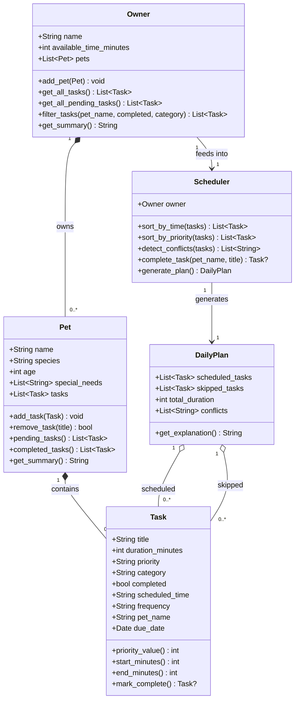

# PawPal+ UML Class Diagram (Final)

```mermaid
classDiagram
    class Owner {
        +String name
        +int available_time_minutes
        +List~Pet~ pets
        +add_pet(Pet) void
        +get_all_tasks() List~Task~
        +get_all_pending_tasks() List~Task~
        +filter_tasks(pet_name, completed, category) List~Task~
        +get_summary() String
    }

    class Pet {
        +String name
        +String species
        +int age
        +List~String~ special_needs
        +List~Task~ tasks
        +add_task(Task) void
        +remove_task(title) bool
        +pending_tasks() List~Task~
        +completed_tasks() List~Task~
        +get_summary() String
    }

    class Task {
        +String title
        +int duration_minutes
        +String priority
        +String category
        +bool completed
        +String scheduled_time
        +String frequency
        +String pet_name
        +Date due_date
        +priority_value() int
        +start_minutes() int
        +end_minutes() int
        +mark_complete() Task?
    }

    class Scheduler {
        +Owner owner
        +sort_by_time(tasks) List~Task~
        +sort_by_priority(tasks) List~Task~
        +detect_conflicts(tasks) List~String~
        +complete_task(pet_name, title) Task?
        +generate_plan() DailyPlan
    }

    class DailyPlan {
        +List~Task~ scheduled_tasks
        +List~Task~ skipped_tasks
        +int total_duration
        +List~String~ conflicts
        +get_explanation() String
    }

    Owner "1" *-- "0..*" Pet : owns
    Pet "1" *-- "0..*" Task : contains
    Owner "1" --> "1" Scheduler : feeds into
    Scheduler "1" --> "1" DailyPlan : generates
    DailyPlan "1" o-- "0..*" Task : scheduled
    DailyPlan "1" o-- "0..*" Task : skipped
```
