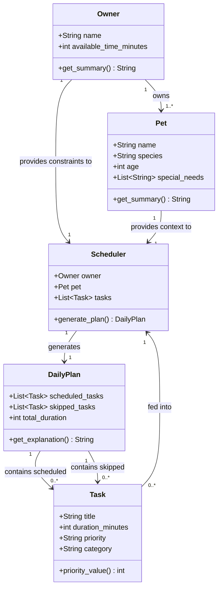

# PawPal+ UML Class Diagram

```mermaid
classDiagram
    class Owner {
        +String name
        +int available_time_minutes
        +get_summary() String
    }

    class Pet {
        +String name
        +String species
        +int age
        +List~String~ special_needs
        +get_summary() String
    }

    class Task {
        +String title
        +int duration_minutes
        +String priority
        +String category
        +priority_value() int
    }

    class Scheduler {
        +Owner owner
        +Pet pet
        +List~Task~ tasks
        +generate_plan() DailyPlan
    }

    class DailyPlan {
        +List~Task~ scheduled_tasks
        +List~Task~ skipped_tasks
        +int total_duration
        +get_explanation() String
    }

    Owner "1" --> "1..*" Pet : owns
    Owner "1" --> "1" Scheduler : provides constraints to
    Pet "1" --> "1" Scheduler : provides context to
    Task "0..*" --> "1" Scheduler : fed into
    Scheduler "1" --> "1" DailyPlan : generates
    DailyPlan "1" --> "0..*" Task : contains scheduled
    DailyPlan "1" --> "0..*" Task : contains skipped
```
